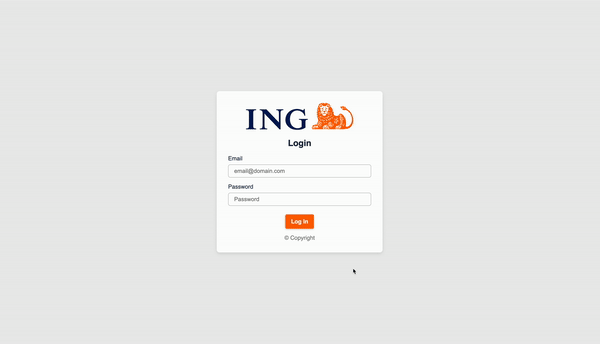

# ING Authentication Application

This application is a simple authentication system built with LitElement and Lion Web Components.

## Table of contents

- [Overview](#overview)
- [Built with](#built-with)
- [Author](#author)

## Overview

Users are able to:

- Log in to the application
- View and edit their user details
- Add/Delete associates
- Dark mode
- View calendar
- Log out of the application

     
     

### Built with

- HTML5 markup
- CSS
- [Lion](https://github.com/ing-bank/lion)
- [Open Web Components](https://open-wc.org/)
- [Vaadin Router](https://vaadin.com/router)

## Author

- LinkedIn - (https://www.linkedin.com/in/sebastian-ciofu/)
